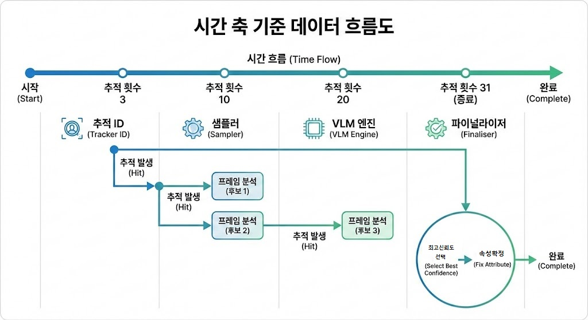

# 1. 프로젝트 개요

 **"원클릭** 으로 작동하는 사용자 맞춤형 **AI 피플 카운팅 시스템"**
 
본 프로젝트는 단일 카메라 환경에서 **YOLOv8n**과 **VLM(CLIP)** 을 결합하여 인원 카운팅 및 상세 속성(성별, 상의 색상)을 분석하는 SW입니다. 

하드웨어 사양에 따라 **VLM 모드(일반)** 와 **Hybrid 모드(저사양)** 를 선택할 수 있는 이원화 아키텍처로 설계되었습니다.

#### ** 핵심 설계 목표**

- **단일 카메라 최적화**: 소규모 공간 및 거리 환경에 특화된 분석 프로세스 구축
    
- **추적 안정성 (Robust Re-ID)**: 밀집 인파 속에서도 ID 스위칭을 최소화하여 중복 카운팅 방지
    
- **하드웨어 범용성**: 불필요한 연산을 제거하여 RTX 4070Ti 기준 **15 FPS+** 확보 및 초저사양 디바이스 확장성 고려
    
- **사용자 편의성** : `setup.py`를 통한 **원클릭** 환경 구축 및 자동화된 분석 레포트 제공


---
# 2. 데모 시연 영상.
-> 📹👉[**Demo Video**](https://youtu.be/P-p50juW5i0 )


---
# 목차
1. [**프로젝트 개요**](#1-프로젝트-개요)
2. [**데모 시연 영상**](#2-데모-시연-영상)
3. [**핵심 기술 구현 및 차별성**](#3-핵심-기술-구현-및-차별성)
4. [**Accuracy & Reliability Evaluation**](#4-accuracy--reliability-evaluation)
5. [**시스템 아키텍쳐 및 속성 정의**](#5-시스템-아키텍쳐-및-속성-정의)
6. [**프로젝트 구조 및 실행 가이드**](#6-프로젝트-구조-및-실행설치-가이드)
7. [**Technical & Future Work**](#7-Technical--Future-Work)
---

# 3. 핵심 기술 구현 및 차별성

본 프로젝트는 단순 AI 모델 사용하는것을 넘어서, 실제 CCTV 관제 상황에서 발생하는 **데이터 왜곡** 과 **시스템 제약** 사항을 극복하기위한 SW를 목표로 잡았습니다.
### 3.1  인원 추적 및 재식별

- **[Challenge]** 다수 인파 환경에서 사람이 가려지는 현상인(Occlusion) 발생 시 ID가 파편화되어 중복 카운팅이 발생하는 문제가 생김
    
- **[Solution]** ByteTrack에 **유클리드 거리 기반 ID Fusion 로직**을 결합했습니다. 추적이 끊긴 직후의 시공간 제약 조건을 분석하여 동일 인물을 재식별(Re-ID)함으로써 데이터의 연속성을 보장합니다.
    

### 3.2 전략적 ROI 추출을 통한 속성 정의 구체화 

- **[Challenge]** 하의 색상, 가방, 복잡한 배경 노이즈가 CLIP 분석에 개입하여 상의 색상 판별 정확도를 저하시키는 현상발생
    
- **[Solution]** 인물 전체 영역이 아닌 **상의 집중 ROI(객체 높이 기준 $12\% \sim 38\%$ 구간)** 만 정밀 타격하여 Crop 합니다. 불필요한 시각적 정보를 원천 차단하여 속성 정의의 순도와 분석 정확도를 극대화했습니다.
    

### 3.3 물리수치 기반 재검증 (VLM + HSV Truth Filter)

- **[Challenge]** 강력한 조명이나 그림자 아래에서 VLM이 검정색 옷을 파란색으로 오인하는 등의 '의미론적 왜곡' 발생.
    
- **[Solution]** CLIP의 추론 결과를 실제 픽셀의 **HSV(채도/명도) 데이터**로 재검증하는 **'Truth Filter'** 를 도입했습니다. 물리적 수치가 기준치 이하일 경우 무채색(Black/Grey/White)으로 강제 보정하여 환경 변화에 Robust한 신뢰도를 확보했습니다.
    

### 3.4 탐지 방어 로직 및 연산 최적화 (Robust Detection & Speed)

- **[Challenge]** 야간 저조도 환경의 그림자/빛 반사로 인한 오탐지 및 고사양 VLM 엔진 구동 시의 연산 부하 문제.
    
- **[Solution]**
    - **Geometric Filter:** 신체 구조적 특징을 분석하는 **종횡비 필터(Aspect Ratio > 1.15)** 와 탐지 임계값 조정을 통해 야간 노이즈를 차단했습니다.
        
    - **Selective Inference:** 모든 프레임 대신 핵심 시점(3, 10, 20 Frame)만 샘플링하는 전략을 통해 RTX 4070Ti 기준 **평균 20 FPS 이상**의 실시간 퍼포먼스를 달성했습니다.
        

### 3.5 데이터 무결성 보장 파이프라인 

- **[Challenge]** 영상 종료 직전 진입 인원이 체류 시간(`DWELL_TIME`) 미달로 통계에서 누락되거나 분석 데이터가 유실되는 현상발생
    
- **[Solution]**
    - **End-of-Stream Flush:** 스트림 종료 감지 즉시 버퍼 내 잔여 데이터를 강제 확정 짓는 예외 처리를 통해 누락 없는 전수 조사를 실현했습니다.
        
    - **Automated Workflow:** `setup.py`를 통한 원클릭 환경 구축부터 영상 종료 후 자동 분석 리포트 생성 및 성능 검증용 샘플링(Best Samples) 저장까지 완전 자동화된 엔드 투 엔드 시스템을 제공합니다.

---
# 4. Accuracy & Reliability Evaluation

시스템의 신뢰성을 검증하기 위해 주/야간 실외 및 역동적인 실내 환경에서 벤치마크 테스트를 수행했습니다. 테스트 결과, 실시간 관제 가이드라인(15 FPS+)을 넘는 **평균 20 FPS 이상의 안정적인 퍼포먼스**를 기록했습니다.

| **평가 환경**  | **대상 영상**      | **ROI 카운팅** | **분석 인원 (Unique IDs)** | **성별 신뢰도** | **색상 신뢰도** | **평균 FPS** |
| ---------- | -------------- | ----------- | ---------------------- | ---------- | ---------- | ---------- |
| **기본 샘플**  | `sample`       | 2명          | 5명                     | **94.00%** | 52.44%     | 20.6       |
| **주간 실외**  | `dev_day`      | **26명**     | 26명                    | **93.06%** | 65.50%     | 20.4       |
| **주간 고밀도** | `eval_day`     | 30명         | 42명                    | 83.25%     | 52.66%     | 19.9       |
| **실내 동적**  | `eval_indoors` | 46명         | 50명                    | 90.88%     | 69.69%     | 20.4       |
| **야간 저조도** | `eval_night`   | 32명         | 47명                    | 89.19%     | 47.25%     | 20.3       |
### 📈 성능 지표 분석 

- **정밀한 Re-ID 및 추적 안정성**:
    - `dev_day` 테스트 결과, 원본 데이터셋 인원(25명) 대비 단 1명의 오차(**26명**)만 기록하며 목표했던 **오차 범위(1~3명) 이내의 정밀 카운팅**에 성공했습니다.
    - `eval_day` 및 `sample` 영상에서 ROI 카운팅보다 분석 인원(Unique IDs)이 높게 측정된 것은, 라인을 통과하기 전 대기 중인 인원까지 **ID Fusion 로직**이 안정적으로 유지하며 선제적 분석을 한 결과입니다.

- **우수한 VLM 제로샷 추론**: 
	- 별도의 추가 학습 없이도 모든 테스트 영상에서 **평균 90% 내외의 성별 판별 신뢰도**를 기록했습니다. 
	- 특히 `sample`에서는 인파가 적고은 주간환경 이라는 점으로  **94%** 의 높은 신뢰도를 보여주며 CLIP 기반 분석 엔진의 범용성을 입증했습니다.
	- 하지만 인파많은 원거리의 야간영상에 신뢰도가 낮은것을 볼때, VLM의 단점은 조명에 의한 색상 왜곡에 취약하다는것이고 개선을위해서는 조명 채색문제를 해결해야할것으로 보입니다.
    
- **연산 최적화 성공**:
    - 고성능 VLM(CLIP)을 탑재했음에도 **선별적 추론(Selective Inference)** 및 **3-step 샘플링** 전략을 통해 전 환경에서 **20 FPS 이상의 실시간성**을 확보했습니다.

+ **색상 물리보정** :
	+ 색상 신뢰도 지표가 성별에 비해 낮은데 이것은 VLM이 조명에 의한 색상 왜곡에 약하기때문입니다. VLM기준 좋은 신뢰도를 줄수도있지만, 한계를 인식하고 HSV Truth Filter 사용하여 물리적 수치로 강제 보정한 결과라 오히려 더 신뢰할만하다 할수 있겠습니다.
	+ 때문에 비교적 낮은 색상신뢰도를 높이기 위해서는 더욱 정밀한 ROI 한정 추출진행해서 배경,악세사리들로 잘못잡히는 비율을 높혀야합니다.


---

# 5. 시스템 아키텍쳐 및 속성 정의

### 5.1 아키텍처 다이어그램

**전체 시스템 아키텍처**


**VLM 속성분석 내부 아키텍쳐**


**데이터흐름도**


---
### 5.2 시스템 엔진 비교표
| **구분**     | **일반 모드 (VLM Mode)**                   | **경량화 모드 (Hybrid Mode)**                     |
| ---------- | -------------------------------------- | -------------------------------------------- |
| **타겟 환경**  | **NVIDIA 외장 GPU (RTX 30/40 시리즈)**      | **CPU 및 내장 그래픽 (Laptop / Edge)**             |
| **핵심 가치**  | **최고 수준의 정밀도 및 제로샷 범용성**               | **실시간 추론 속도 및 자원 효율성**                       |
| **객체 탐지**  | **YOLOv8n** (Detection)                | **YOLOv8n** (Detection)                      |
| **객체 추적**  | **ByteTrack** (Supervision)            | **ByteTrack** (Supervision)                  |
| **추적 안정화** | **ID Fusion (유클리드 거리 기반 Re-ID)**       | **ID Fusion (유클리드 거리 기반 Re-ID)**             |
| **성별 분석**  | **OpenAI CLIP (ViT-B/16)** (Semantic)  | **YOLOv8n-cls** (Lightweight Classification) |
| **의상 색상**  | **OpenAI CLIP (ViT-B/16)** (Zero-shot) | **HSV K-Means Clustering** (수학적 통계)          |
| **보정 로직**  | **HSV Truth Filter (물리적 수치 검증)**       | **Temporal Weighted Voting (시계열 투표)**        |
| **성능 특징**  | RTX 4070Ti 기준 **평균 20 FPS+** 확보        | 저사양 환경 **실시간성(15 FPS+)** 최우선                 |

---

### 5.3 실험 환경 및 속성 정의 

>본 프로젝트는 시스템의 범용성과 신뢰성을 입증하기 위해 다양한 조도 및 카메라 환경을 가진 데이터셋을 활용했으며, 속성 판별 시 노이즈를 최소화하도록 분석 영역을 구체적으로 정의했습니다.

#### 📍  데이터셋 구성
YOLOv8n 기반 탐지와 CLIP 분석의 강건함을 테스트하기 위해 주/야간 및 동적 시점의 영상을 활용했습니다.

| **Dataset**  | **파일명**            | **환경 특징**  | **평가 목적**                |
| ------------ | ------------------ | ---------- | ------------------------ |
| **MOT16-09** | `dev_day.mp4`      | 주간, 고정 카메라 | 알고리즘 개발 및 속성 인식 최적화      |
| **MOT16-04** | `eval_night.mp4`   | 야간, 고밀도 인파 | 저조도 환경 탐지 및 트래킹 안정성 테스트  |
| **MOT16-03** | `eval_indoors.mp4` | 실내, 동적 카메라 | 카메라 흔들림 시의 ID 유지력 검증     |
| **Oxford**   | `eval_day.mp4`     | 주간, 고밀도 거리 | 대규모 인파 환경에서의 Re-ID 성능 확보 |

#### 📍 속성 추출 및 분석 정의 (Attribute Specifics)
속성 정의의 구체성을 확보하기 위해 분석 ROI를 세분화하고 제로샷(Zero-shot) 프롬프트 앙상블을 적용했습니다.

| **Attribute**        | **분석 구역 (ROI)**            | **판별 로직 및 전략**                                 |
| -------------------- | -------------------------- | ---------------------------------------------- |
| **성별 (Gender)**      | 상체 및 얼굴 위주 (Height 0%~70%) | CLIP 프롬프트 앙상블 (Man/Woman 등 10종 확률 합산)          |
| **상의 색상 (Color)**    | **Upper-Chest (12%~38%)**  | 상의 전용 ROI 추출 + **HSV 물리적 수치 검증(Truth Filter)** |
| **최종 결정 (Decision)** | 시계열 데이터 활용                 | 3단계 샘플링 중 최고 확신도(Confidence) 결과 채택             |


> "※ 본 성능 평가는 시스템의 최대 성능과 우수성을 입증하기 위해 **VLM 모드(일반모드)**를 기준으로 수행되었습니다. 저사양(Hybrid) 모드는 자원 제약 환경을 위한 호환성 유지용으로 제공되며, 성능 수치는 환경에 따라 상이할 수 있습니다."

---

# 6. 프로젝트 구조 및 설치/실행 가이드

>본 프로젝트는 평가자의 편의를 위해 **원클릭 환경 구축 스크립트**를 제공합니다. 복잡한 라이브러리 설치 과정 없이 바로 실행이 가능합니다.

---
### 6.1 Project Structure

```text
TASK-people-counter/
│
├── data/                 # 개발 & 테스트용 영상 파일
│   ├── dev_day.mp4       # 주간 실외 / 고정 카메라
│   ├── eval_day.mp4      # 주간 실외 / 고정 카메라
│   ├── eval_night.mp4    # 야간 실외 / 고정 카메라
│   └── eval_indoors.mp4  # 실내     / 동적 카메라 
│
├── models/               # YOLO,CLIP 모델 가중치 저장소
│   ├── yolov8n.pt        # YOLO 모델 다운로드(파일이 미리없어도 자동다운)
│   ├── yolov8n-cls.pt    
│   └── ViT-B-16.pt       # VLM 모델 다운로드(파일이 미리없어도 자동다운)
│
├── logs/                 # 영상종료 결과 로그 보관소
│   └── report_.txt       
│
├── best_samples/         # 신뢰도 상위 크롭 이미지 보관소
│   └── name_date_.jpg     
│
├── src/                  # 모듈 패키지
│   ├── __init__.py       # (빈 파일) 패키지 인식용
│   ├── config.py         # 설정 값 모음
│   ├── engine.py         # VLM 분석 엔진 (VLMAttributeEngine)
│   └── utils.py          # 레포트결과 저장 및 UI 표시 로직
│
├── main.py               # 메인 실행 파일
├── setup.py              # [New] 자동 설치 스크립트
├── requirements.txt      # 의존성 목록 (Torch 제외)
├── README.md             # 프로젝트 문서
└── start.bat             # 간편 영상실행
```

---
### 6.2 시스템 요구 사양
#### 💻 개발 및 테스트 환경 
- **Python:** 3.11.14
- **Framework:** PyTorch 2.0 (CUDA 12.1)
- **Hardware:** RTX 4070Ti (12GB) / RAM 48GB (DDR4)
- **OS:** Windows 10 (Local PC)
#### 📋 시스템 요구 사양
| **구분**      | **권장 사양 (VLM 모드)**        | **최소 사양 (저사양 모드)**  |
| ----------- | ------------------------- | ------------------- |
| **Python**  | 3.11 ~ 3.12 (Conda 환경 권장) | 3.8+                |
| **GPU**     | NVIDIA RTX 30 시리즈 이상      | Intel/AMD 내장 그래픽 가능 |
| **RAM**     | 16GB 이상 (32GB 최적)         | 8GB 이상              |
| **Storage** | 5GB 이상의 여유 공간             | 5GB 이상의 여유 공간       |

---

### 6.3 설치 및 실행 방법

**⚠️ 설치전 참고사항  
- **Python 3.13 사용자 주의:** 현재 PyTorch CUDA 지원이 불안정할 수 있으므로 GPU 가속을 위해 **3.11~3.12** 환경을 강력히 권장합니다.

#### 1단계 : 🔰 레포지토리 클론 및 이동

```bash 
# 레포지토리 클론 
git clone https://github.com/ardor924/TASK-people-counter
# 폴더 이동
cd TASK-people-counter
```

#### 2단계 : 🎥 영상 준비
하단 링크에서 테스트 영상을 다운로드하여 `data/` 폴더에 넣어주세요. (**영상을 받지 않았을 경우 샘플영상으로 실행됩니다.)

- **다운 링크**

	▶ sample.avi(TownCentreXVID) :  주간-카메라고정 실외영상 : 기본내장
	
	▶ [dev_day.mp4(MOT16-09) :  주간-카메라고정 실외영상](https://drive.google.com/uc?export=download&id=1zLggWjesXdZrG913pr9JdhvCqYgtWygr)	
	
	▶ [eval_day.mp4(Oxford Town Centre) :  주간-카메라고정 실외영상](https://drive.google.com/uc?export=download&id=10FdQ7iV6_I9FuJIQAT3X3ImvHl9f7LWF)
	
	▶ [eval_night.mp4(MOT16-04) : 야간-카메라고정 실외영상(붐비는,원거리)](https://drive.google.com/uc?export=download&id=1PAaZPVPciWOAVZ8t-A1qJy4_dvDwAG0i)
	
	▶ [eval_indoors.mp4(MOT16-03) : 실내-비고정/동적 카메라 영상](https://drive.google.com/uc?export=download&id=1ZKL2iqgjA5LUfd9dUvikreBxUsdDELLc)

- **출처:** [MOT Challenge 2016](https://motchallenge.net/data/MOT16/), [Oxford Town Centre](https://exposing.ai/oxford_town_centre/) (CC BY-NC-SA 4.0)

#### **3단계: 실행**
##### 방법 1: 원클릭 자동 실행 (Window용) 
-  (✅추천) 일반 모드(VLM Mode): `start.bat` 실행 
- 저사양 모드(Hybrid Mode): `start-low.bat` 실행

> `bat 스크립트` 실행 시 가상환경 생성, 라이브러리(`YOLO`, `CLIP` 등) 및 모델 가중치 설치 후 즉시 `main.py`가 실행됩니다.

##### 방법 2: IDE(VS Code/PyCharm) 수동 설치

1. 가상환경(venv/conda) 활성화
2. `python setup.py` 실행 (의존성 및 폴더 구조 자동 세팅)
3. `python main.py` 실행

##### 방법 3: Mac 사용자 

```Bash
chmod +x start-low-for-mac.sh
./start-low-for-mac.sh
```


---
### 🚀 팁 (Tip)

- **가상환경 이름 주의:** 자동화 스크립트가 `ai_counter_env`라는 이름을 사용하므로, 수동 생성 시 이 이름과 겹치지 않게 주의해 주세요.
    
- **경로 변경:** 영상 파일 경로나 모델 설정을 바꾸려면 `config.py`(VLM용)  `main-low.py`(경량화용)  상단의 환경 설정 변수를 수정하세요.   

+ 영상종료 키는 `q` 로 바인딩 되어있습니다.

+ 영상이 종료될때 키보드로 `q` 를 누르면 레포트도 종료됩니다.

+ Best_samples/ 폴더 에서 실행한 영상의 성별 신뢰도가 가장 높은 5명의 이미지가 저장되었으니 성능 비교 확인용으로 참고할수 있습니다.

+ logs 폴더에 결과후 보고서를 저장해놓았습니다. 성능 비교 확인용으로 참고할수 있습니다.

---
# 7.  Technical & Future Work

### 7-1. 기술변경

>개발 과정에서 성능과 정확도의 트레이드오프를 고려하여 다음과 같이 설계를 변경했습니다.

- **❌ 초기 설계 (Heuristic Approach)**: `YOLOv8n + HSV + K-means`
    
    - **문제점**: 수학적 통계 방식만으로는 다양한 조명 환경과 복잡한 구도에서 성별 및 의상 특징을 추출하는 데 한계가 있음을 확인했습니다.
        
- **✅ 최종 설계 (VLM Approach)**: `YOLOv8n + CLIP(ViT-B/16) + HSV Hybrid`
    
    - **결정 사유**: 과제의 핵심 목표인 **'SW 우수성(정확성)'** 을 달성하기 위해 최신 SOTA 모델인 CLIP을 도입했습니다. 연산 부하 문제는 **선별적 추론(Selective Inference)** 기법으로 해결하여 RTX 4070 Ti 기준 **15 FPS+** 의 실시간성을 확보했습니다.

---
### 7-2. 추후 도전과제 (Future Works)

1. **성능 최적화 및 에지 디바이스(Edge Device) 대응**
	+  향후 임베디드 및 저사양 환경에서의 구동을 위해 **VLM(CLIP: ViT-B/16)** 및 **Qwen** 등 대형 VLM 모델을 **ONNX** 또는 **NCNN** 포맷으로의 변환
	+  INT8/FP16 양자화 를 적용하여 정밀도를 유지하면서 추론속도를 올리는 최적화를 추가할것을 기대

2. **일관된 배포 환경 구성**
    - 대규모 배포나 서버 환경 확장을 위해서는 **Docker**를 활용한 컨테이너 기반의 일관성 있는 배포가 필요
    
3. **데이터 관리 및 EDA 활용**
    - SQLite 연동을 통한 누적 카운팅 또는 특성 데이터저장
    - 분석된 성별,복장 데이터를 대시보드화하여 실시간 통계 시각화 로직 구현

4. **UI/UX 개선**
	+ 개발 프로토타입 이므로 상용화및 실무 배포 하기 위해서 깔끔한 폰트와 UI/UX를 추가

5. **하드웨어 성능별 브랜치관리**
	+ 고성능,일반성능,경량화 버전별로 개발 브랜치 나눠서 고도화

6. **TensorRT/ONNX 가속 적용**
	-  Intel iGPU (내장 그래픽12GB) 노트북환경에서 경량화 모델 구동시 FPS가 8~10 수준으로 나왔기때문에 저사양하드웨어에서 추론속도를 위해 TensorRT/ONNX 가속을 적용하여 실시간성(15 FPS+)확보하는것으로 개선

---


